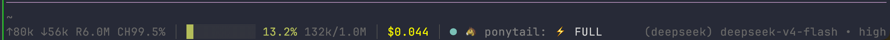

# pi-quota-dashboard

[English](./README.md) · **简体中文**

给 [pi coding agent](https://pi.dev) 的只读额度 / 余额 / 会话面板 —— **Claude、OpenAI Codex、DeepSeek 三家挤进底栏一行**。

生态里其他扩展要么只查订阅窗口（Anthropic OAuth、Codex），要么只查 API 余额（DeepSeek）。这个两样都做，因为它们本来就是两种计费概念，面板不该把它们混成一个数字。



这张图是 DeepSeek 场景，余额充足，所以额度段自己撤掉了，不留空位。换成订阅制 provider 时，同一行末尾会是：

```
🟡 7d 25% ↻4d11h                            Codex Pro —— 账户只有这一个 7 天窗口
🟢 5h 98% ↻3h12m 🟡 7d 49% 🔴 Fable 13%     Claude —— 一个窗口一盏灯
```

验证版本 **pi 0.85.1 / Node 22.20.0**。

## 特点

- **显示剩余额度，不是已用** —— 关心的是还能用多少。
- **一行，不是三行。** pi 内置 footer 占三行（工作目录 / 统计 / 扩展状态），这里全部并成一行。
- **只显示账户真正有的窗口。** Codex Pro 账户只返回一个 7 天窗口，没有 5h、没有 code review 桶 —— 这些不会被凭空造成 "unavailable" 条目。
- **绝不写凭据。** 不自动登录、不刷新 token、不写 `auth.json`。凭据过期就如实报 `expired`，不动它。
- **不声称自己不知道的事。** `activeAccountVerified` 恒为 `false`，理由见[诚实是设计出来的](#诚实是设计出来的)。

## 安装

```sh
pi install git:github.com/mufeiyu-ayu/pi-quota-dashboard
```

然后在 pi 会话里执行 `/reload`。无需 `npm install`，依赖由 pi 提供。

本地开发：

```sh
git clone https://github.com/mufeiyu-ayu/pi-quota-dashboard.git
pi install ./pi-quota-dashboard
```

## 底栏

pi 内置 footer 占三行：工作目录、统计、扩展状态。本扩展用 `ui.setFooter()` 把三行全部并成**一行**，每段自带图标，用 `│` 分段：

```
🤖 high · gpt-6-astra │ 🌿 main │ 📊 ██░░░░░░░░ 18.5% 185k/1.0M │ 💰 $0.061 │ 🟡 7d 25% ↻4d11h
└──── 模型 ─────────┘   └分支─┘   └───────── 上下文 ────────┘   └─ 费用 ─┘   └──── 额度 ────┘
```

整行左对齐 —— 没有任何东西被推到最右边、最先被截断的位置。

- **思考强度排在模型名前面**，用 pi 自己的 thinking 分级色（灰 → 蓝 → 紫 → 品红），强度一眼可辨。
- **不显示厂商。** `gpt-6-astra`、`deepseek-v4-flash`、`claude-fable-5-1` 本身就说明是哪一家，这个前缀白占 16 列。
- **只显示 git 分支，不显示工作目录。** 分支才是会变、值得盯的那部分；自己在哪个项目你本来就知道。不在 git 仓库里时整段消失。
- **费用用常规前景色。** 黄色留给有语义的信号（额度告急、上下文接近上限），一个纯装饰的黄会和它们撞色。

### 上下文

10 格进度条 + 百分比 + 绝对计数。条身与数字同色，阈值沿用 pi 的 **70% 黄 / 90% 红**。压缩之后到下一次响应之前，百分比显示 `?` —— pi 此时确实不知道，不猜。

### 额度

| 元素 | 含义 |
|---|---|
| 🟢 🟡 🔴 | 每个窗口一盏灯，灯本身就是分隔符。按**剩余**分档：>50% 绿 / >20% 黄 / 其余红 |
| ⚪ | 数据过期未刷新（stale）。此时百分比不着色 —— 红绿灯只在当次刷新过的数据上才代表真实水位 |
| `5h` `7d` `1d` | 窗口时长，从 `durationSeconds` 推导。模型专属周窗补模型名（`7d Opus`），`weekly_scoped` 用服务返回的显示名（`Fable`），Codex code review 桶前缀 `CR` |
| `25%` | **剩余** 25%，不是已用 |
| `↻4d11h` | 重置倒计时，只给最短的窗口显示 —— 它最先重置，也最常撞上 |
| 🔴 `¥0.00` | API 余额**只在见底时**提示（服务报 `is_available:false`，或截断到 2 位后为零/负）。余额不像配额那样会在会话中途用光，平时不占位，完整数字看 `/dashboard` |
| ⏳ / ⚠️ | 查询中 / 取不到（`?`、`n/a`、`auth`、`expired`、`403`、`429`、`error`）。健康的 `ok` 不写状态词 |

**没有数据的窗口整个略去**，不占一个 `?%` 的位置。当前 provider 没有额度概念时整条撤掉，不留空位。

### 按宽度降级

窄终端不该把额度 —— 这个扩展的主角 —— 挤出行外。所以是按优先级丢段，不是无脑截断：

| 终端宽度 | 显示 |
|---|---|
| 宽 | `🤖 high · model │ 🌿 main │ 📊 ██░░░░░░░░ 18.5% 185k/1.0M │ 💰 $0.061 │ 状态` |
| 窄 | 丢绝对 token 计数 —— 进度条和百分比已经说明同一件事 |
| 更窄 | 再丢分支 |
| 最窄 | 整行从右侧截断。模型、额度和其他扩展状态不会作为整段被丢掉 |

`setStatus()` 照常发布，所以别的扩展接管 footer 时本插件依然显示；`session_shutdown` 交还内置 footer。

### 与内置 footer 的差异

都是扩展 API 的边界所致，不是选择：

| 项 | 说明 |
|---|---|
| `(auto)` | **不显示**。`autoCompactionEnabled` 只在 pi 内部的 session 对象上，`ExtensionContext` 拿不到。与其显示一个可能过期的标记，不如不显示 |
| 厂商前缀 | **不显示**。配置了多个 provider 时 pi 会打印 `(openai-codex)`；模型 id 已经能说明是哪一家 |
| `(sub)` | 与 pi 的 `isUsingSubscription` 同构，但 `isUsingOAuth` 依赖的 `snapshot.auth` 不可达，改用 `readStoredCredential(id)?.type === 'oauth' && provider.auth.oauth.isSubscription`。environment/runtime 的 OAuth 会漏标 —— 宁可漏也不猜 |
| `↑↓RW` `CH` | **不显示**。分方向的 token 明细和缓存命中率已由费用段与上下文段覆盖；累计 token 数仍在 `/dashboard` 里 |
| `$?` | pi 直接显示累加值；这里保持保守口径 —— **计费过的**响应报 cost=0 时这个数不可信，就明说。分项全为 0 的空响应（中断、切模型）零成本自洽，不会抹掉整轮会话 |

其余（上下文着色阈值、截断行为）与内置 footer 一致。

## 命令

| 命令 | 作用 |
|---|---|
| `/dashboard` | 重新读取存储/环境凭据来源，打印完整的脱敏 JSON 快照。额度在 60 秒 TTL 内复用 |
| `/dashboard refresh` | 绕过正常 TTL，但**不绕过失败退避** |

快照不进入模型上下文，也不落盘。

## 诚实是设计出来的

这个扩展值得一读的地方，在于它对"自己知道什么"很克制。

- **`activeAccountVerified` 恒为 `false`。** 下面那些 guards 能挡住可见的覆盖，但挡不住 `before_provider_headers` 钩子悄悄换账户，磁盘配置也可能与已加载配置不同。所以即使拿到 200，也只标注为"代表*存储/环境账户*"，而非已验证的活动请求账户。不读私有 runtime，不执行 header hooks 去猜。
- **订阅额度与 API 余额严格分开**（`kind`）。额度和余额不是可以互换的数字。
- **余额保持十进制字符串。** 不做浮点换算，不换汇。底栏截断到 2 位，丢掉非零位时补 `+`，所以极小的正余额不会显示成干巴巴的 `0.00`。
- **零不等于免费。** pi 会把缺失的价格初始化为零；计费过的响应报 `cost: 0` 时报 unknown，不当成实测的免费调用。
- **过期不等于新鲜。** 刷新失败保留原来的 `fetchedAt` 并标 `stale`，绝不改头换面成一次成功刷新。

### 凭据处理

- 重用 pi 导出的 `readStoredCredential` 与**原装** provider `oauth.toAuth` / DeepSeek `apiKey.resolve`。绝不调用可能刷新/写入的 `getProviderAuth` / `getApiKeyAndHeaders`。
- API key 支持明文，或单个 `$ENV` / `${ENV}` 引用（provider-scoped env 优先）。`!command` 凭据和复合模板**绝不执行**，直接报 `unsupported`。
- runtime 临时凭据、已注册 provider 覆盖、非官方 `baseUrl`、可见 headers、`models.json` 里当前 provider/model 的鉴权配置，一律退回 `unsupported`。
- 请求只进入固定的官方 HTTPS 路径。拒绝 redirect（`redirect: 'manual'`），不把模型的 `baseUrl` 当额度目标，不记录 token、headers、raw error body、账号或指纹。

### 接口

| Provider | 端点 | 鉴权 |
|---|---|---|
| Claude | `GET https://api.anthropic.com/api/oauth/usage` | OAuth bearer + `anthropic-beta: oauth-2025-04-20` |
| Codex | `GET https://chatgpt.com/backend-api/wham/usage` | OAuth bearer + `ChatGPT-Account-Id` |
| DeepSeek | `GET https://api.deepseek.com/user/balance` | Bearer API key |

Claude 和 Codex 用的是官方服务的内部/非稳定额度接口，不承诺永久兼容。DeepSeek 依据其[官方余额文档](https://api-docs.deepseek.com/api/get-user-balance)。

### 缓存与生命周期

缓存按 provider + 固定端点 + token + account 的 SHA-256 指纹隔离（指纹不输出），两个账户永远读不到彼此的数据。同 key 的并发请求合并，最多 16 项。HTTP 8 秒含响应体，鉴权单独 8 秒，响应体上限 256 KiB。失败按 60/120/240/300 秒退避，支持 `Retry-After`（秒或 HTTP-date，上限一天）。401/403/429 不做任何绕路。

仅 UI 模式下每 60 秒轮询。所有发布入口和异步结果都独立比对 provider/model/baseUrl 身份，模型切换会取消在途请求并丢弃迟到结果，而不是把它算到新模型头上。HTTP 调用后重读凭据 —— 期间变过就丢弃结果，不发布到错误的账户名下。缓存只在内存。

## Provider 支持

| Provider | 上报内容 |
|---|---|
| `anthropic` | `five_hour`、`seven_day`、模型专属周窗（`seven_day_opus`、`seven_day_sonnet`、`weekly_scoped`） |
| `openai-codex` | `rate_limit` 与 `code_review_rate_limit` 的 primary/secondary 窗口 —— 账户实际返回哪些就是哪些 |
| `deepseek` | 精确的 CNY/USD API 余额，十进制字符串 |

其他 provider 报 `unsupported`，该段整条撤掉。

> **关于 Claude：** pi 文档明确，第三方 harness 对 Claude 订阅的调用消耗 extra usage、按 token 计费，而不走计划窗口。这里的 5h/7d 是官方接口返回的账户计划额度，**不是 pi 的可用预算**。没有把 `extra_usage` 字段或会话估算成本混进计划窗口。

## 开发

```sh
node --test test/*.test.mjs

# 只打印用法，不联网
node scripts/smoke.mjs

# 显式、免费、只读的真实 GET；输出脱敏业务字段与 HTTP 状态，绝不输出凭据
node scripts/smoke.mjs --live
node scripts/smoke.mjs --live deepseek
```

测试中的 `FAKE_*` 均为模拟。另有真实 installed loader、原装 auth 函数（fake credential）、内置 `FooterComponent` 与本扩展合并 footer 各自在 0/1/2/3/8/20/40/80/160 列的检查 —— 不启动 pi CLI，不发模型请求。合并 footer 经 pi 真实扩展 loader 注册的 factory 渲染，不绕过加载链路。

独立脚本默认从当前 Node 的全局安装目录定位 pi，其他布局可设 `PI_DASHBOARD_PI_ROOT`。集成测试断言 `pi.VERSION === '0.85.1'` —— pi 升级时这条会故意变红，提示先复核 auth、loader 和 footer API 再更新断言。

## 署名

Claude 与 Codex 的端点及响应字段研究参考了 uppinote 的 [claude-dashboard](https://github.com/uppinote20/claude-dashboard)（MIT）。本包自行实现凭据处理、解析、缓存与生命周期接入，不执行也不再分发该 bundle。详见 [THIRD_PARTY_NOTICES.md](./THIRD_PARTY_NOTICES.md)。

## 许可

MIT
